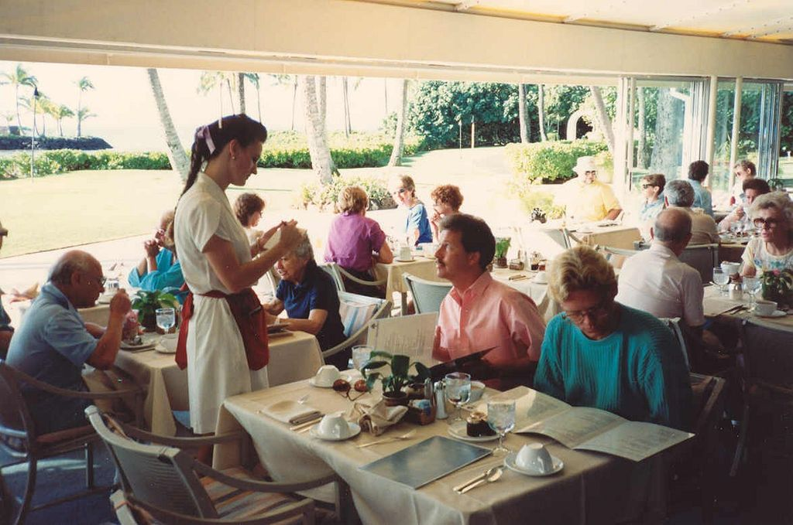
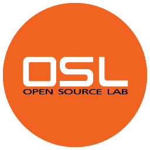
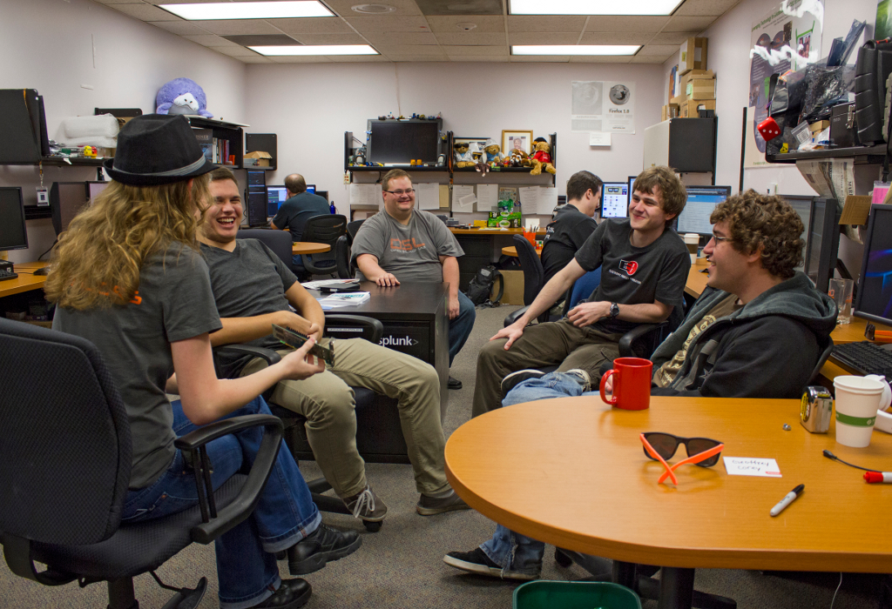
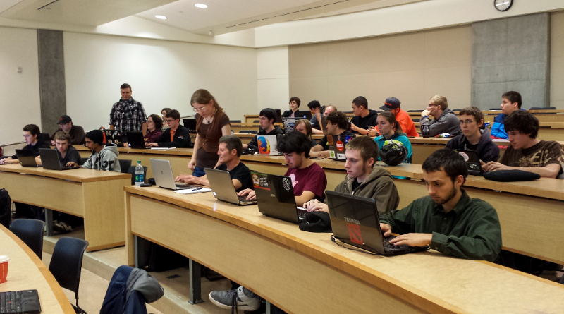
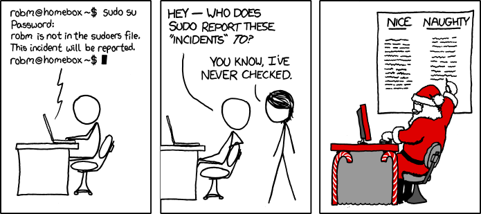
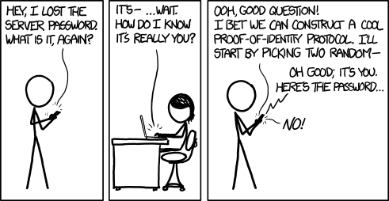

DevOps for University Students
==============================

:authors: Lance Albertson, Emily Dunham
:title: Director, Student Systems Engineer
:company: OSU Open Source Lab
:email: lance@osuosl.org, edunham@osuosl.org
:twitter: @ramereth

*Attribution-ShareAlike CC BY-SA ©2014*

.. toctree::
  :hidden:

  proposal
  proposal_osbridge
  scale12x
  chefconf2014
  linuxfestnorthwest2014

About Us 
--------

Lance

- OSU Open Source Lab Director
- Systems Admin background
- Been at OSL since 2007

Emily

- OSL student since 2011
- Urban Airship ops intern this summer

Session Overview
----------------

.. note:: Lance

.. rst-class:: build

- Current Learning Environment
- OSL Student Experience
- Devops Bootcamp
- Next Steps

Current Learning Environment
----------------------------

.. figure:: _static/dragonbook.jpg
    :scale: 90%
    :align: center

.. note:: "Purple dragon book b" by Derived from a digital capture
    (photo/scan) of the book cover (creator of this digital version is irrelevant
    as the copyright in all equivalent images is still held by the same party).
    Copyright held by the publisher or the artist. Claimed as fair use
    regardless.. Licensed under Fair use of copyrighted material in the context of
    Dragon Book (computer science) via Wikipedia -
    http://en.wikipedia.org/wiki/File:Purple_dragon_book_b.jpg#mediaviewer/File:Purple_dragon_book_b.jpg 

There be dragons!

Theory vs. Applied
------------------

.. note:: Emily & discuss own experience with how OSU teaches CS

- More focus on theory than applied

  - Classwork rarely mimics real-world
  - Difficult to apply theory

.. note:: "Math lecture at TKK" by Tungsten - photo taken by Tungsten.
    Licensed under Public domain via Wikimedia Commons -
    http://commons.wikimedia.org/wiki/File:Math_lecture_at_TKK.JPG#mediaviewer/File:Math_lecture_at_TKK.JPG

Student Jobs
------------

.. note:: Emily
    Also, more students TA than get to work at OSL/Helpdesk/BSG... this does
    *not* teach good software development, or any sysadminning

.. note:: photo by Judy Baxter, https://www.flickr.com/photos/judybaxter/14999803/

*Finding experience on campus*

- Limited roles and access
- Limited availability
- No structure

Insufficient Mentoring
----------------------

.. figure:: _static/osl-noc2.jpg
  :align: center
  :scale: 55%

.. note:: Lance

- No dedicated staff/faculty
- LUG's help, but not the solution 
- No centralized program

  - Need a place for advanced students to excel more
  - Also need an environment for *"newbies"*
- Limited qualified staff with time to mentor

OSL Student Experience
======================

Giving students real-world experience and mentorship

OSL Overview
------------

.. note:: Lance

- Provide hosting for FOSS projects
- Services we provide

  - Co/Location
  - Virtualization (Cloud)
  - Managed/Unmanaged hosting
  - Email, DNS, mailing list, etc
- Development focused on supporting hosting
- Media communications team

OSL NOC
-------

OSL Student Experience
----------------------

.. note:: Emily on own experience with how it's awesome

- Given full *"root"*
- Spend six months mentoring

  - Mix of full-timer and senior student mentorships
- Work on support tickets and customers
- Interact with people internationally
- Ownership of a project
- Treated like a full-timer

Scaling problem
---------------

.. note:: Lance

.. rst-class:: build

- Balancing FTE to Student ratios
- A lot of time and resource is put in mentoring
- OSL Students represent less than 1% of OSU CS population
- Budget constraints on hiring more students
- Only so much work to be done

DevOps Bootcamp
===============

.. note:: picture of something on this slide, and speaker notes on topic
    transition

Expanding DevOps beyond the OSL...

http://devopsbootcamp.osuosl.org

Portland State *"Braindump"*
----------------------------

.. note:: Lance

- Weekly meet up to teach being sysadmin
- In-depth teaching on specific topics (DNS, Apache, etc)
- Graduated system

  - Start out with helpdesk support
  - Get "non-root" access to systems
  - "Rooter"
- Year long program

  - Starts out with 60+ end up with ~10 solid recruits

http://braindump.cat.pdx.edu

Free Online Classes
-------------------

.. note:: Emily

- Designed to be completely self-directed
- Need lots of time and specific learning style

- OpsSchool

   - Tends to be sysadmin-focused
   - Very old-school
   - Ops equivalent of CS MOOCs
- MIT OpenCourseWare
- Coursera
- edx.org

Adapt PSU's Braindump
---------------------

.. note:: Lance

Making it work for the OSL and OSU .. and DevOps Bootcamp was born!

**Goals:**

.. rst-class:: build

- Teach basic system administration skills
- Introduce FOSS development
- Introduce Devops philosophy
- Publicize all the content (Creative Commons, yay!)
- Eventually integrate into OSU EECS program
- Make it easy for anyone to attend and contribute

Program Structure
-----------------

.. note:: Emily

- Weekly meet ups about a specific topic
- Weekly content planning meetings
- Simple *exercises* each week
- Combined lecture and hands on
- Driven by both OSL Staff and students

..

- Communication

  - Mailing list
  - IRC
  - LUG

Tools
-----

.. note:: Lance, with why we chose each

.. rst-class:: build

- Vagrant

  - CentOS/Debian VMs
- Github

  - Exercises, example applications & scripts
  - https://github.com/devopsbootcamp
- Sphinx-doc and Read The Docs

  - Hieroglyph for slides
- Google Hangouts Live (screen shot recording)
- OpenStack

  - *Planned for next iteration of bootcamp*

Curriculum Topics
-----------------

.. note:: Lance

- Linux Basics
- Basic System Administration
- Basic FOSS Development Methodologies
- Base infrastructure services for any organization

  - DNS, Email, web server, database servers, etc
- Introduce configuration management
- Content based from `CS312 Sysadmin class`_

  - *Last taught in 2009, planned for Winter Term 2015*

.. _CS312 Sysadmin class: http://osuosl.org/students/cs312

Learning from breaking
----------------------

.. note:: Emily:

  Yes most of us are self-taught but I've noticed that things I've learned from
  others via mentorship are much easier to teach in person. Also, on the
  diversity note, having a *safe* place to play is extremely important because
  when someone's dealing with the issues that plague minorities in tech
  (tokenism, impostor syndrome, etc.) there are a lot more factors telling you
  "no don't risk breaking that, even if you might learn something" than there
  would be for a non-minority.

- How did we learn these skills ourselves?

  - Self learning!
  - Support community (LUG, friends, mentors, etc)
- Access to a production-like environments ``==`` safe place to *play*
- Preconfigured by us, but then modified by them
- Introduce troubleshooting via breakage

.. figure:: _static/xkcd_705.png
  :align: center
  :scale: 70%

Lessons
-------

.. note:: Emily

- :The Very Basics: Shell, Vagrant+Virtualbox setup, IRC
- :Single System Fundamentals:
    File permissions, users, groups and package management
- :Editors and Git: Vim, Emacs, and Git for version control

Lessons
-------

.. note:: Lance

- :Scripting & Troubleshooting:
    Python and Bash. Overview of troubleshooting / debugging skills.
- :Services & Deploying a Web App:
    Web application overview, frameworks, virtualenv, sample app (systemview)
- :Boot Process & Filesystem Hierarchy:
    Filesystems, mkfs, fsck, boot process, single user mode, init scripts
- :Databases:
    SQL basics, mysql, databases in web apps, hands on

Lessons
-------

.. note:: Lance

- :Security & Authentication:
    Basics, system security, attack types, cryptos, MTM, code injection
- :Networking overview:
    OSI Model, IPv4, netmasks
- :DNS:
    DNS Basics, records, relation to web app development

Lessons
-------

- :Automation and DevOps:
    Config Management overview, devops history
- :Configuration Management:
    Basics, examples with puppet and chef, hands on with puppet
- :Open Source:
    Joining a project, licenses, communities

.. figure:: _static/xkcd_1172.png
  :align: center
  :scale: 70%

Feedback
--------

.. note:: Lance

- Attendance

  - First meeting: 34 | Other meetings: 10-20
- Format seems to work
- Vagrant and Virtualbox can be a PITA
- Recording using Google Hangouts is great *(but buggy)*
- Having everything in git is awesome
- It takes a long time to make content
- We didn't cover everything we wanted
- Learn to be flexible
- K.I.S.S. (Keep It Simple Stupid)

Making your own DOBC
--------------------

.. note:: Emily

- This sounds great, you want to start something like this?
- DO IT!

  - Even if you're not sure.
  - Even if you don't know all the things yet.
  - You'll learn fast.
- Resources are everywhere

  - Anyone who says they think it's cool
- Offer bite-sized ways to contribute

  - Speak for 15 minutes on your specialty?
  - vs. be on a curriculum committee forever

Lessons Learned
---------------

- Time management

    - You're a sysadmin; automate yourself out of a job
    - Calendar reminders for recurring tasks
    - You wouldn't rewrite the same code; planning and bureaucratic overhead
      are also reusable
- Skills can be taught; enthusiasm can't.

Next Steps
==========

.. note:: Lance. Add picture

Building a mock infrastructure
------------------------------

- Build a breakable infrastructure

  - Best to learn from real-world experience
  - But not production (yet)
- Basic services:

  - DNS, Email, web, database, etc
- Develop a basic webapp collaboratively
- Utilize configuration management (puppet / chef)
- Use the cloud (i.e. OpenStack, AWS, etc)
- *Planning to implement this next year*

Plans
-----

- Continue to build more content *(and tweak it)*
- Include outside speakers from the industry
- Include contributions from external sources

  - Because, FOSS!
- Develop new curriculum in EECS program

  - Create a side track focused on DevOps
- Expand beyond OSU to other Universities

Questions?
==========

:name: Lance Albertson, Emily Dunham
:company: OSU Open Source Lab
:email: lance@osuosl.org, edunham@osuosl.org
:twitter: @ramereth @osuosl
:devopsbootcamp: http://devopsbootcamp.osuosl.org
:github: https://github.com/devopsbootcamp

*Attribution-ShareAlike CC BY-SA ©2014*
