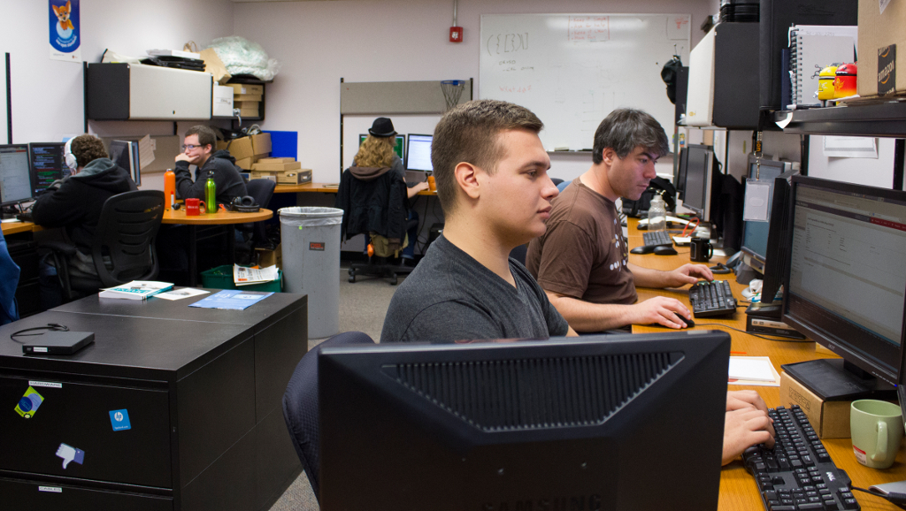

DevOps for University Students
==============================

:author: Lance Albertson
:title: Director / Sysadmin / Cat Herder
:company: OSU Open Source Lab
:email: lance@osuosl.org
:twitter: @ramereth

*Attribution-ShareAlike CC BY-SA ©2014*

.. toctree::
  :hidden:

  proposal
  proposal_osbridge
  scale12x

About Us 
--------

Lance

- OSU Open Source Lab Director
- Systems Admin background
- Been at OSL since 2007
- Experienced in:

  - Virtualization (Ganeti/KVM)
  - cfengine, puppet, chef
  - CentOS/Gentoo
  - Mentoring students
- Gentoo Developer

Emily

- OSL student since 2011
- Urban Airship ops intern this summer
- 

Session Overview
----------------

.. note:: Lance?

.. rst-class:: build

- Current Learning Environment
- OSL Student Experience
- Devops Bootcamp
- Next Steps

Current Learning Environment
============================

.. note:: picture of a dragon? perhaps the Dragon Book?

There be dragons!

Theory vs. Applied
------------------

.. note:: Emily & discuss own experience with how OSU teaches CS?

- More focus on theory than applied

  - Classwork rarely mimics real-world
  - Difficult to apply theory

.. figure:: _static/xkcd-171-string-theory.png
  :align: center
  :scale: 90%

Student Jobs
------------

.. note:: Emily 
    Also, more students TA than get to work at OSL/Helpdesk/BSG... this does
    *not* teach good software development, or any sysadminning

*Finding experience on campus*

- Limited roles and access
- Limited availability 
- No structure

Insufficient Mentoring
----------------------

.. note:: Lance

- No dedicated staff/faculty
- LUG's help, but not the solution 
- No centralized program

  - Need a place for advanced students to excel more
  - Also need an environment for *"newbies"*
- Limited qualified staff with time to mentor

OSL Student Experience
======================

.. note:: Picture of OSL logo or something?

Giving students real-world experience and mentorship

OSL Overview
------------

.. note:: Lance

- Provide hosting for FOSS projects
- Services we provide

  - Co/Location
  - Virtualization (Cloud)
  - Managed/Unmanaged hosting
  - Email, DNS, mailing list, etc
- Development focused on supporting hosting
- Media communications team

OSL NOC
-------

.. figure:: _static/osl-noc.jpg
  :align: center
  :scale: 80%

OSL Student Experience
----------------------

.. note:: Emily on own experience with how it's awesome

- Given full *"root"*
- Spend six months mentoring

  - Mix of full-timer and senior student mentorships
- Work on support tickets and customers
- Interact with people internationally
- Ownership of a project
- Treated like a full-timer

Scaling problem
---------------

.. note:: Lance

.. rst-class:: build

- Balancing FTE to Student ratios
- A lot of time and resource is put in mentoring
- OSL Students represent less than 1% of OSU CS population
- Budget constraints on hiring more students
- Only so much work to be done

DevOps Bootcamp
===============

.. note:: picture of something on this slide, and speaker notes on topic
    transition

Expanding DevOps beyond the OSL...

http://devopsbootcamp.osuosl.org

Portland State *"Braindump"*
----------------------------

.. note:: Lance

- Weekly meet up to teach being sysadmin
- In-depth teaching on specific topics (DNS, Apache, etc)
- Graduated system

  - Start out with helpdesk support
  - Get "non-root" access to systems
  - "Rooter"
- Year long program

  - Starts out with 60+ end up with ~10 solid recruits

http://braindump.cat.pdx.edu

Free Online Classes
-------------------

.. note:: Emily?

- Designed to be completely self-directed
- Need lots of time and specific learning style

- OpsSchool

   - Tends to be sysadmin-focused

    - Very old-school
    - Ops equivalent of CS MOOCs
- MIT OpenCourseWare
- Coursera
- edx.org

Adapt PSU's Braindump
---------------------

.. note:: Lance

Making it work for the OSL and OSU .. and DevOps Bootcamp was born!

**Goals:**

.. rst-class:: build

- Teach basic system administration skills
- Introduce FOSS development
- Introduce Devops philosophy
- Publicize all the content (Creative Commons, yay!)
- Eventually integrate into OSU EECS program
- Make it easy for anyone to attend and contribute

Program Structure
-----------------

.. note:: Emily?

- Weekly meet ups about a specific topic
- Weekly content planning meetings
- Simple *exercises* each week
- Combined lecture and hands on
- Driven by both OSL Staff and students

.. figure:: _static/dobc.jpg
  :align: right
  :scale: 60%

..

- Communication

  - Mailing list
  - IRC
  - LUG

Tools
-----

.. note:: Lance, with why we chose each

.. rst-class:: build

- Vagrant

  - CentOS/Debian VMs
- Github

  - Exercises, example applications & scripts
  - https://github.com/devopsbootcamp
- Sphinx-doc and Read The Docs

  - Hieroglyph for slides
- Google Hangouts Live (screen shot recording)
- OpenStack

  - *Implementation a work in progress*

Curriculum
----------

.. note:: Who?

- Linux Basics
- Basic System Administration
- Basic FOSS Development Methodologies
- Base infrastructure services for any organization
  
  - DNS, Email, web server, database servers, etc
- Building a mock infrastructure for a mock company from top to bottom
- Introduce configuration management
- Content based from `CS312 Sysadmin class`_
  
  - *last taught in 2009*

.. _CS312 Sysadmin class: http://osuosl.org/students/cs312

Topics discussed so far
-----------------------

.. note:: Re-title this slide. Also, who?

.. rst-class:: build

- **The Basics:** Shell, file permissions, package management
- Editors and git
- Scripting & Troubleshooting
- Services and deploying a web app
- Boot process and filesystem hierarchy
- Databases
- Security & Authentication, Networking

.. figure:: _static/xkcd_838.png
  :align: center 
  :scale: 55%

Building a mock infrastructure
------------------------------

- Build a breakable infrastructure

  - Best to learn from real-world experience
  - But not production (yet)
- Basic services:
  
  - DNS, Email, web, database, etc
- Develop a basic webapp collaboratively
- Utilize configuration management (puppet / chef)
- Use the cloud (i.e. OpenStack, AWS, etc)
- *This is still a work in progress...*

Learning from breaking
----------------------

.. note:: Emily: Yes most of us are self-taught but I've noticed that things
    I've learned from others via mentorship are much easier to teach in
    person. Also, on the diversity note, having a *safe* place to play is
    extremely important because when someone's dealing with the issues that
    plague minorities in tech (tokenism, impostor syndrome, etc.) there are a
    lot more factors telling you "no don't risk breaking that, even if you
    might learn something" than there would be for a non-minority.

- How did we learn these skills ourselves?

  - Self learning!
  - Support community (LUG, friends, mentors, etc)
- Mock infrastructure gives them a safe place to *play*
- Preconfigured by us, but then modified by them
- Introduce troubleshooting via breakage

.. figure:: _static/xkcd_705.png
  :align: center
  :scale: 80%

Feedback
--------

.. note:: Lance?

- Attendance

  - First meeting: 34 | Other meetings: 10-20
- Format seems to work
- Vagrant and Virtualbox can be a PITA
- Recording using Google Hangouts is great (but buggy)
- Having everything in git is awesome
- It takes a long time to make content
- We started way too late
- Learn to be flexible
- K.I.S.S. (Keep It Simple Stupid)

Advice to myself a year ago
---------------------------

.. note:: Emily. Also this slide needs a better title. And has too many words.

- This sounds great, you want to start something like this?
- DO IT! 
    - Even if you're not sure.
    - Even if you don't know all the things yet.
    - You'll learn fast.
- Resources are everywhere
    - Anyone who says they think it's cool
    - Offer bite-sized ways to contribute
        - Speak for 15 minutes on your specialty? 
        - vs. be on a curriculum committee forever
- Time management
    - You're a sysadmin; automate yourself out of a job
    - Calendar reminders for recurring tasks
    - You wouldn't rewrite the same code; planning and bureaucratic overhead
      are also reusable
- Skills can be taught; enthusiasm can't.

Next Steps
==========

.. note:: Lance. Also this should be one slide, or have a picture on the 'next
    steps' one

Plans
-----

- Continue to build more content *(and tweak it)*
- Include outside speakers from the industry
- Include contributions from external sources

  - Because, FOSS!
- Develop new curriculum in EECS program

  - Create a side track focused on DevOps
- Expand beyond OSU to other Universities

Questions?
==========

.. note:: E should figure out how to make this slide two-column or something
    also, UA or OSL? 

:name: Lance Albertson
:company: OSU Open Source Lab
:email: lance@osuosl.org
:twitter: @ramereth @osuosl
:blog: http://lancealbertson.com
:devopsbootcamp: http://devopsbootcamp.osuosl.org
:github: https://github.com/devopsbootcamp

:name: Emily Dunham
:company: Urban Airship
:email: edunham@osuosl.org
:github: https://github.com/edunham

*Attribution-ShareAlike CC BY-SA ©2014*
